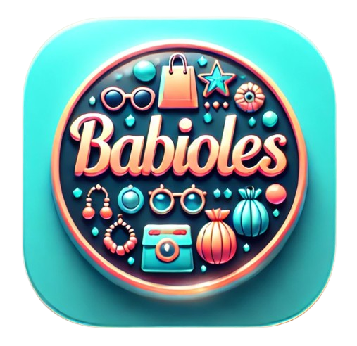
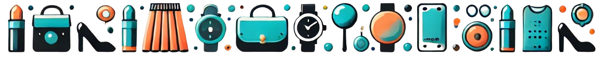

# Présentation du Projet

### <u>🛍️ '**Babioles**' c'est quoi ?</u>

***Il s'agit d'une boutique en ligne offrant une sélection variée d'accessoires à des prix accessibles. Notre objectif est d'enrichir le quotidien de nos clients avec une gamme de produits ajoutant une touche de fantaisie et de style. Nous proposons des bijoux fantaisie, divers accessoires de mode, des gadgets pratiques comme des stylos et porte-clés, ainsi que des produits de beauté. Cette variété fait de ***Babioles*** un lieu idéal pour trouver des articles tendance et originaux.***

## <u>🎯 But du Projet</u>
**Ce projet sert de terrain d'apprentissage pour approfondir mes compétences en JavaScript et en développement avec la bibliothèque React, tout en révisant et en appliquant des concepts essentiels de conception de systèmes informatiques.** En développant ***Babioles***, je souhaite non seulement créer une plateforme en ligne fonctionnelle mais également renforcer mes connaissances théoriques par une mise en pratique concrète.

## <u>👩‍🎓 Objectifs d'Apprentissage</u>

### Côté Interface Utilisateur

- **Conception de Projet** : Réviser la partie conception, notamment sur l'établissement d'un contrôle d'accès basé sur les rôles (RBAC) et en définissant les règles de gestion. Et sur l'utilisation de la méthode Merise pour structurer la base de données et la création des diagrammes UML pour modéliser l'architecture globale et les interactions entre les composants du système.

- **Maîtriser JavaScript** : Approfondir la compréhension des fondamentaux, explorer la programmation orientée objet et découvrir les techniques d'asynchronisme.

- **Développer avec React** : Construire des interfaces utilisateur réactives et apprendre à gérer l'état des composants pour une expérience utilisateur améliorée.

### Coté API

Dans le cadre de ce projet, mon objectif est également de consolider mes compétences en me concentrant aussi sur le langage **Python**. Ce qui me permettra d'explorer de nouveaux **frameworks comme Django et FastAPI**, avec la mise en place d'une architecture en couches.

---
<!-- Bouton 'Retour vers le Sommaire' et Bouton 'Retour vers haut' du document -->

    

    

